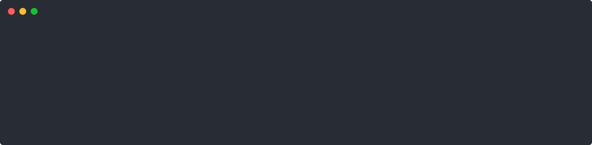

# lazyai

Browse and resume Claude Code, Antigravity, and Codex sessions with one consistent CLI.

## Quick start

```bash
curl -fsSL https://raw.githubusercontent.com/jimmyliao/lazyaicli/main/install.sh | bash
lazyai
```

`lazyai` opens AGY by default. Change the default at any time:

```bash
lazyai default codex
lazyai default claude
lazyai default agy
```

## Backend demos

The captures below are generated by running the real `lazyai` binary against deterministic fake sessions and dry-running each backend resume command.

### AGY



### Claude Code


### Codex


## Runtime dependency guarantee

`lazyai` is distributed as a self-contained executable. Users do **not** need to install Python, uv, jq, fzf, Node packages, or other runtime libraries.

- `ags` requires only the existing `agy` CLI when resuming a session.
- `ccs` requires only the existing `claude` CLI when resuming a session.
- `cxs` requires only the existing `codex` CLI when resuming a session.
- Listing and searching local sessions work without launching the backend CLI.

Supported release targets: Linux and macOS on amd64 and arm64.

## Command reference

This section mirrors `lazyai --help`. The CLI contract tests prevent these commands from silently drifting.

```text
lazyai — browse and resume AI coding sessions

Usage:
  lazyai [backend] [query]
  lazyai default [backend]
  lazyai list
  lazyai doctor
  lazyai [options]

Backends:
  agy       Antigravity sessions (default)
  claude    Claude Code sessions
  codex     Codex sessions

Commands:
  lazyai                 Open the default backend
  lazyai agy             Open AGY session picker
  lazyai claude          Open Claude session picker
  lazyai codex           Open Codex session picker
  lazyai list            List available backends
  lazyai default         Show the default backend
  lazyai default <name>  Set the default backend
  lazyai doctor          Check installation and configuration

Session selection:
  lazyai codex -l        List Codex sessions
  lazyai claude 1        Resume the newest Claude session
  lazyai agy keyword     Resume the newest matching AGY session

Options:
  -l, --list             List sessions without resuming
  -h, --help             Show help
  -V, --version          Show version

Direct commands:
  ags                    Same as: lazyai agy
  ccs                    Same as: lazyai claude
  cxs                    Same as: lazyai codex

Examples:
  lazyai
  lazyai default codex
  lazyai claude auth
  lazyai codex -l
```

### Backend status and default

```bash
lazyai list                 # installed backend CLIs and current default
lazyai default              # print current default; fresh installs use agy
lazyai default codex        # persist a new default
lazyai doctor               # configuration path and backend checks
```

The default is stored at `~/.config/lazyai/config.toml` on Linux and the platform user-config directory elsewhere. Set `LAZYAI_CONFIG` to override the path.

### Session selection

Every backend has the same interface:

```bash
lazyai agy                  # numbered interactive picker
lazyai claude -l            # list without resuming
lazyai codex 1              # resume newest session
lazyai claude auth          # newest title or id match
```

Direct commands are equivalent:

```bash
ags                         # lazyai agy
ccs                         # lazyai claude
cxs                         # lazyai codex
```

Session paths can be overridden for tests or custom installations with `AGY_HOME`, `CLAUDE_PROJECTS`, and `CODEX_HOME`.

## Shell integration

The installer sources small shell functions so the parent shell stays in the resumed session directory after the backend exits. The self-contained binary performs parsing and selection; the functions only perform the final `cd` and backend invocation.

## Install

The installer downloads the release binary for the current OS and architecture, links `lazyai`, `lazyaicli`, `ags`, `ccs`, and `cxs` into `~/.local/bin`, and adds shell integration.

```bash
curl -fsSL https://raw.githubusercontent.com/jimmyliao/lazyaicli/main/install.sh | bash
```

Overrides: `LAZYAI_VERSION`, `LAZYAI_BINARY`, `LAZYAICLI_DIR`, and `LAZYAICLI_BIN_DIR`.

`lazyaicli` remains as a compatibility alias for `lazyai`.

## Development and tests

Go is a build dependency only; it is not a user runtime dependency.

```bash
go build -o dist/lazyai ./cmd/lazyai
tests/cli_contract.sh
tests/backend_flows.sh
tests/install_binary.sh
```

The backend flow suite uses deterministic fake sessions and fake backend executables. It verifies listing, matching, resume commands, direct aliases, and parent-shell directory behavior for all three backends.

## License

MIT © 2026 Jimmy Liao
